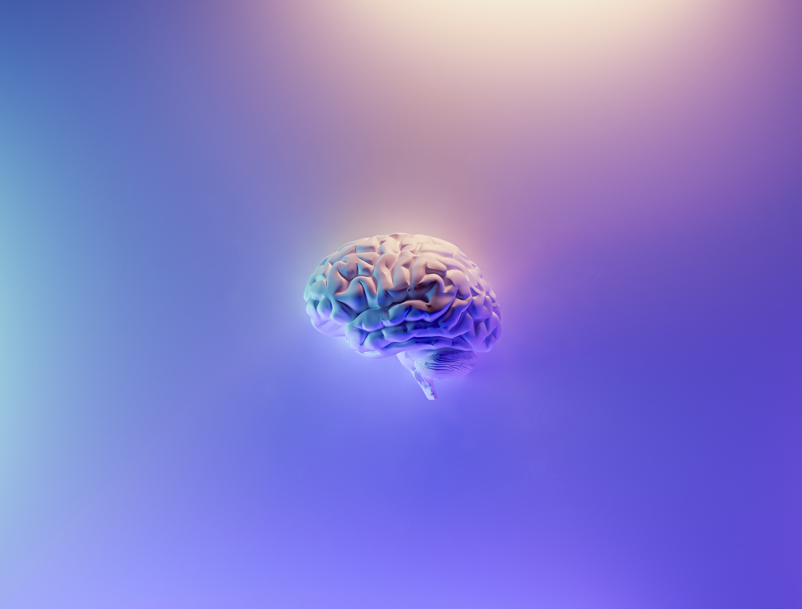

# Cómo la Inteligencia Artificial Revoluciona el Marketing Digital

## Impulsando Estrategias y Maximizando Resultados

La **Inteligencia Artificial (IA)** ha dejado de ser una fantasía futurista para convertirse en una herramienta esencial en diversas industrias. El mundo del marketing digital, con sus cambiantes tendencias y la necesidad de personalización, encuentra en la IA un aliado poderoso.

En primer lugar, la IA ha permitido la creación de chatbots avanzados que mejoran la experiencia del cliente. Estos [chatbots](https://www.forbes.com/es/2020/01/14/el-futuro-de-los-chatbots-para-2020/#64537c9c7c01) no solo responden dudas de forma casi instantánea, sino que aprenden de las interacciones para ofrecer respuestas más precisas con el tiempo. Para los profesionales del marketing, esto significa una mayor eficiencia en la atención al cliente y, a menudo, una mejor conversión de visitantes a clientes.

En segundo lugar, la personalización es una demanda creciente de los consumidores modernos. A través de algoritmos de IA, es posible analizar grandes volúmenes de datos y ofrecer contenidos, anuncios o productos que se alinean directamente con los intereses del usuario. [Harvard Business Review](https://hbr.org/2018/01/how-companies-are-already-using-ai) destaca que la personalización basada en la IA puede mejorar las tasas de conversión hasta en un 15%. Esto indica la enorme oportunidad que representa para los especialistas en marketing.

Finalmente, la IA también tiene un impacto significativo en el análisis predictivo. Esta tecnología puede prever tendencias del mercado basadas en datos históricos y actuales, permitiendo a las empresas anticiparse a las necesidades del consumidor. Estas predicciones pueden abarcar desde los productos que serán populares en los próximos meses hasta identificar a los posibles clientes que podrían abandonar un servicio. Websites especializados como [MIT Technology Review](https://www.technologyreview.com/) han resaltado cómo la IA, con herramientas como el machine learning, está redefiniendo la forma en que se hace marketing, permitiendo tomar decisiones más informadas y estratégicas.

Para concluir, la IA no es solo una tendencia pasajera en el mundo del marketing digital. Es una herramienta que está transformando activamente la forma en que las empresas interactúan con sus clientes, personalizan sus experiencias y anticipan sus necesidades. Los profesionales del marketing que adopten y se adapten a estas tecnologías tendrán una ventaja competitiva en el mercado.

---

Miguel González
23.09.02
